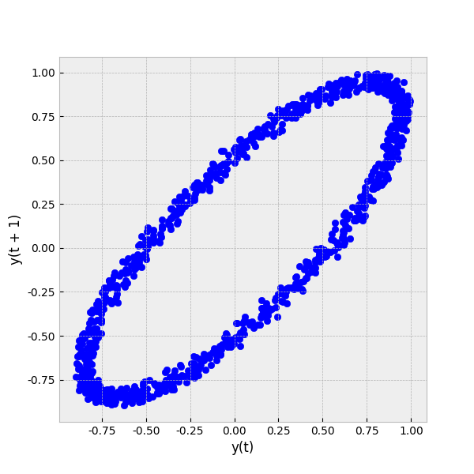

导入模块
```python
>>> import numpy as np
>>> from EasyPandas import read, plot, factor
>>> iris = read("../data/iris.xlsx")
```

Series的线图绘制
```python
>>> np.random.seed(123456)
>>> ts = pd.Series(np.random.randn(1000), index=pd.date_range("1/1/2000", periods=1000))
>>> ts = ts.cumsum()
>>> plot(ts, plottype="line", savefilename="./image/plot1.png")
```


DataFrame的线图绘制
```python
>>> np.random.seed(123456)
>>> df = pd.DataFrame(np.random.randn(1000, 4), index=pd.date_range("1/1/2000", periods=1000), columns=list("ABCD"))
>>> df = df.cumsum()
>>> plot(df, plottype="line", savefilename="./image/plot2.png")
```


Series的线图绘制，给定参数
```python
>>> np.random.seed(123456)
>>> ts = pd.Series(np.random.randn(1000), index=pd.date_range("1/1/2000", periods=1000))
>>> ts = ts.cumsum()
>>> plot(ts, plottype="line", color="black", savefilename="./image/plot3.png")
```


绘制xy之间的线图
```python
>>> np.random.seed(123456)
>>> df = pd.DataFrame(np.random.randn(1000, 4), index=pd.date_range("1/1/2000", periods=1000), columns=list("ABCD"))
>>> df = df.cumsum()
>>> df["A"] = range(1, 1+df.shape[0])
>>> plot(df, plottype="line", x="A", y="C", savefilename="./image/plot4.png")
```


Series的柱状图
```python
>>> np.random.seed(123456)
>>> df = pd.DataFrame(np.random.randn(1000, 4), index=pd.date_range("1/1/2000", periods=1000), columns=list("ABCD"))
>>> df = df.cumsum()
>>> plot(df.iloc[4, ], plottype="bar", savefilename="./image/plot5.png")
```


DataFrame的柱状图
```python
>>> np.random.seed(123456)
>>> df = pd.DataFrame(np.random.randn(1000, 4), index=pd.date_range("1/1/2000", periods=1000), columns=list("ABCD"))
>>> df = df.cumsum()
>>> plot(df.iloc[:4, ], plottype="bar", savefilename="./image/plot6.png")
```


DataFrame的柱状图，堆叠形式
```python
>>> np.random.seed(123456)
>>> df = pd.DataFrame(np.random.randn(1000, 4), index=pd.date_range("1/1/2000", periods=1000), columns=list("ABCD"))
>>> df = df.cumsum()
>>> plot(df.iloc[:4, ], plottype="bar", stacked=True, savefilename="./image/plot7.png")
```


Series的水平柱状图
```python
>>> np.random.seed(123456)
>>> df = pd.DataFrame(np.random.randn(1000, 4), index=pd.date_range("1/1/2000", periods=1000), columns=list("ABCD"))
>>> df = df.cumsum()
>>> plot(df.iloc[4, ], plottype="barh", savefilename="./image/plot8.png")
```


DataFrame的水平柱状图
```python
>>> np.random.seed(123456)
>>> df = pd.DataFrame(np.random.randn(1000, 4), index=pd.date_range("1/1/2000", periods=1000), columns=list("ABCD"))
>>> df = df.cumsum()
>>> plot(df.iloc[:4, ], plottype="barh", savefilename="./image/plot9.png")
```


DataFrame的水平柱状图，堆叠形式
```python
>>> np.random.seed(123456)
>>> df = pd.DataFrame(np.random.randn(1000, 4), index=pd.date_range("1/1/2000", periods=1000), columns=list("ABCD"))
>>> df = df.cumsum()
>>> plot(df.iloc[:4, ], plottype="barh", stacked=True, savefilename="./image/plot10.png")
```


Series的直方图
```python
>>> np.random.seed(123456)
>>> df = pd.DataFrame(np.random.randn(1000, 4), index=pd.date_range("1/1/2000", periods=1000), columns=list("ABCD"))
>>> df = df.cumsum()
>>> plot(df.iloc[:, 0], plottype="hist", savefilename="./image/plot11.png")
```


DataFrame的直方图
```python
>>> np.random.seed(123456)
>>> df = pd.DataFrame(np.random.randn(1000, 4), index=pd.date_range("1/1/2000", periods=1000), columns=list("ABCD"))
>>> df = df.cumsum()
>>> plot(df, plottype="hist", savefilename="./image/plot12.png")
```


DataFrame的直方图，堆叠形式
```python
>>> np.random.seed(123456)
>>> df = pd.DataFrame(np.random.randn(1000, 4), index=pd.date_range("1/1/2000", periods=1000), columns=list("ABCD"))
>>> df = df.cumsum()
>>> plot(df, plottype="hist", stacked=True, savefilename="./image/plot13.png")
```


Series的箱线图
```python
>>> np.random.seed(123456)
>>> df = pd.DataFrame(np.random.rand(10, 5), columns=["A", "B", "C", "D", "E"])
>>> plot(df["A"], plottype="box", savefilename="./image/plot14.png")
```


DataFrame的箱线图
```python
>>> np.random.seed(123456)
>>> df = pd.DataFrame(np.random.rand(10, 5), columns=["A", "B", "C", "D", "E"])
>>> plot(df, plottype="box", savefilename="./image/plot15.png")
```


DataFrame的分组箱线图
```python
>>> np.random.seed(123456)
>>> df = pd.DataFrame(np.random.rand(10, 5), columns=["A", "B", "C", "D", "E"])
>>> df["X"] = pd.Series(["A", "A", "A", "A", "A", "B", "B", "B", "B", "B"])
>>> plot(df, plottype="box", by="X", savefilename="./image/plot16.png")
```


Series的面积图
```python
>>> np.random.seed(123456)
>>> df = pd.DataFrame(np.random.rand(1000, 4), index=pd.date_range("1/1/2000", periods=1000), columns=list("ABCD"))
>>> plot(df.loc[: ,"A"], plottype="area", savefilename="./image/plot17.png")
```


DataFrame的面积图
```python
>>> np.random.seed(123456)
>>> df = pd.DataFrame(np.random.rand(1000, 4), index=pd.date_range("1/1/2000", periods=1000), columns=list("ABCD"))
>>> plot(df, plottype="area", savefilename="./image/plot18.png")
```


散点图
```python
>>> plot(iris, plottype="scatter", x="Sepal.Length", y="Sepal.Width", savefilename="./image/plot19.png")
```


散点图，参数
```python
>>> plot(iris, plottype="scatter", x="Sepal.Length", y="Sepal.Width", s=50, color="black", alpha=0.3, savefilename="./image/plot20.png")
```


散点图，参数
```python
>>> iris["category_species"] = factor(iris["Species"], as_category=1)
>>> plot(iris, plottype="scatter", x="Sepal.Length", y="Sepal.Width", s=50, c="category_species", alpha=0.3, colormap="Set2", savefilename="./image/plot21.png")
```


Series的饼图
```python
>>> np.random.seed(123456)
>>> series = pd.Series(3 * np.random.rand(4), index=["a", "b", "c", "d"], name="series")
>>> plot(series, plottype="pie", savefilename="./image/plot22.png")
```


DataFrame的饼图
```python
>>> np.random.seed(123456)
>>> df = pd.DataFrame(3 * np.random.rand(4, 2), index=["a", "b", "c", "d"], columns=["x", "y"])
>>> plot(df, plottype="pie", savefilename="./image/plot23.png")
```


DataFrame的scattermatrix
```python
>>> np.random.seed(123456)
>>> plot(iris.iloc[:, 1:-1], plottype="scatter_matrix", savefilename="./image/plot24.png")
```


DataFrame的andrew曲线
```python
>>> np.random.seed(123456)
>>> plot(iris.iloc[:, 1:-1], plottype="andrews_curves", class_column="Species", savefilename="./image/plot25.png")
```


DataFrame的parallel_coordinates曲线
```python
>>> np.random.seed(123456)
>>> plot(iris.iloc[:, 1:-1], plottype="parallel_coordinates", class_column="Species", savefilename="./image/plot26.png")
```


Series的lag_plot曲线
```python
>>> np.random.seed(123456)
>>> spacing = np.linspace(-99 * np.pi, 99 * np.pi, num=1000)
>>> data = pd.Series(0.1 * np.random.rand(1000) + 0.9 * np.sin(spacing))
>>> plot(data, plottype="lag_plot", savefilename="./image/plot27.png")
```



Series的lag_plot曲线，给定参数
```python
>>> np.random.seed(123456)
>>> spacing = np.linspace(-99 * np.pi, 99 * np.pi, num=1000)
>>> data = pd.Series(0.1 * np.random.rand(1000) + 0.9 * np.sin(spacing))
>>> plot(data, plottype="lag_plot", lag=3, savefilename="./image/plot28.png")
```


Series的autocorrelation_plot曲线
```python
>>> np.random.seed(123456)
>>> spacing = np.linspace(-99 * np.pi, 99 * np.pi, num=1000)
>>> data = pd.Series(0.1 * np.random.rand(1000) + 0.9 * np.sin(spacing))
>>> plot(data, plottype="autocorrelation_plot", savefilename="./image/plot29.png")
```


保存文件
```python
>>> np.random.seed(123456)
>>> spacing = np.linspace(-99 * np.pi, 99 * np.pi, num=1000)
>>> data = pd.Series(0.1 * np.random.rand(1000) + 0.9 * np.sin(spacing))
>>> plot(data, "autocorrelation_plot", "./image/plot30.png")
```


